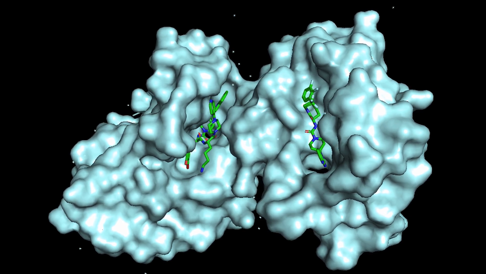

---
title: "CGRP IC50 Prediction Project"
format: html
toc: false
---

{fig-align="center" width="900"}

** [**Launch the CGRP IC50 Predictor App**](https://cgrp-ic50-predictor.streamlit.app) **

## Project Overview

This project explores the use of machine learning to predict inhibitory activity for compounds targeting the **Calcitonin Gene-Related Peptide (CGRP) receptor**, a key therapeutic target in migraine treatment. Using bioactivity data obtained from the ChEMBL database, I developed a regression model capable of estimating **IC50 values** for candidate molecules based on their chemical structure.

The project integrates cheminformatics and machine learning workflows. Molecular structures are represented using **SMILES notation**, which are converted into numerical fingerprints that capture chemical features relevant to biological activity. These fingerprints are then used to train a **Random Forest regression model** capable of predicting inhibitory potency for previously unseen compounds.

## Project Components

The project is organized into several components that document the workflow from data acquisition through model deployment.

### Data Analysis and Dataset Preparation

The notebook below contains the data collection and exploratory analysis steps. Bioactivity data for CGRP receptor inhibitors was retrieved from ChEMBL and curated to produce a dataset suitable for machine learning analysis. The notebook also includes initial chemical descriptor exploration and data preprocessing.

** [CGRP Analysis Notebook](https://github.com/danigeiger/CGRP_project/blob/main/notebooks/CGRP_Analysis.ipynb) **

### Model Development and Testing

This notebook focuses on converting molecular structures into machine-learning features and training predictive models. Molecular fingerprints are generated, the dataset is split into training and testing sets, and multiple models are evaluated to determine which approach best predicts IC50 values.

** [Model Building Notebook](https://github.com/danigeiger/CGRP_project/blob/main/notebooks/CGRP_model_building_testing.ipynb) **

### Model Optimization

Once a baseline model was established, additional hyperparameter tuning was performed to improve predictive performance. Grid search techniques were used to explore parameter combinations for several tree-based models, leading to the final Random Forest model used in the application.

**  [Model Hypertuning Notebook](https://github.com/danigeiger/CGRP_project/blob/main/notebooks/CGRP_model_hypertuning.ipynb)  **

### Interactive Prediction Application

To make the model accessible to users without programming experience, the final model was deployed as an interactive **Streamlit application**. The app allows users to upload molecules in SMILES format and receive predicted IC50 values. This interface demonstrates how machine learning models developed in a research workflow can be translated into practical screening tools.

**  [Continue to README.md for more on the project](https://github.com/danigeiger/CGRP_project?tab=readme-ov-file#cgrp-inhibitory-drug-discovery-for-the-treatment-of-migraine)  **

**  [View Application Code](https://github.com/
danigeiger/CGRP_project/blob/main/app.py)  **